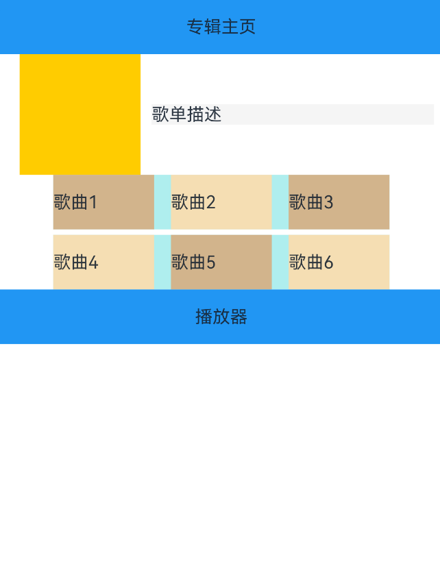
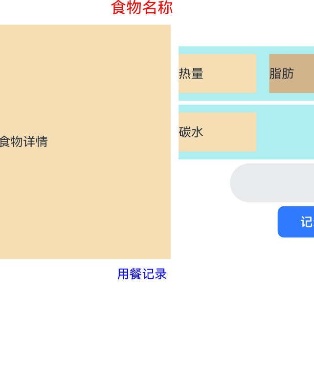

# AutoDev Sample

[AutoDev](https://github.com/unit-mesh/auto-dev) 场景分析

- ArkUI 生成
- ArkTS 代码补全
- Android/微信小程序代码迁移
- 测试代码生成

## Sample

### MusicPlayer

Official: https://gitee.com/harmonyos/samples/tree/master/MultiDeviceAppDev/MusicAlbum

```ArkTS
// 音乐专辑主页
// 头部返回栏: 因元素单一、位置固定在顶部，因此适合采用自适应拉伸，充分利用顶部区域。
// 专辑封面: 使用栅格组件控制占比，在小尺寸屏幕下封面图与歌单描述在同一行。
// 歌曲列表: 使用栅格组件控制宽度，在小尺寸屏幕下宽度为屏幕的100%，中尺寸屏幕下宽度为屏幕的50%，大尺寸屏幕下宽度为屏幕的75%。
// 播放器: 采用自适应拉伸，充分使用底部区域。
```

Result:



官方示例：


### 

```ArkTS
// 生成一个：健康饮食详细页。
// 要求：使用滑动组件展示食物的详细信息，包括使用画布组件展示单位重量的食物各个营养元素的的占比,使用进度条组件展示当前食物是否为高热食物，
以及展示单位重量的食物所包含的热量、脂肪、蛋白质、碳水以及维他命C值；并且点击记录按钮可以弹出记录饮食的弹窗，包括记录食物的种类、重量以及用餐时间，
可以通过点击完成添加饮食，同时添加的饮食信息会在“记录”Tab页签做展示。
```

Result:



官方示例：

