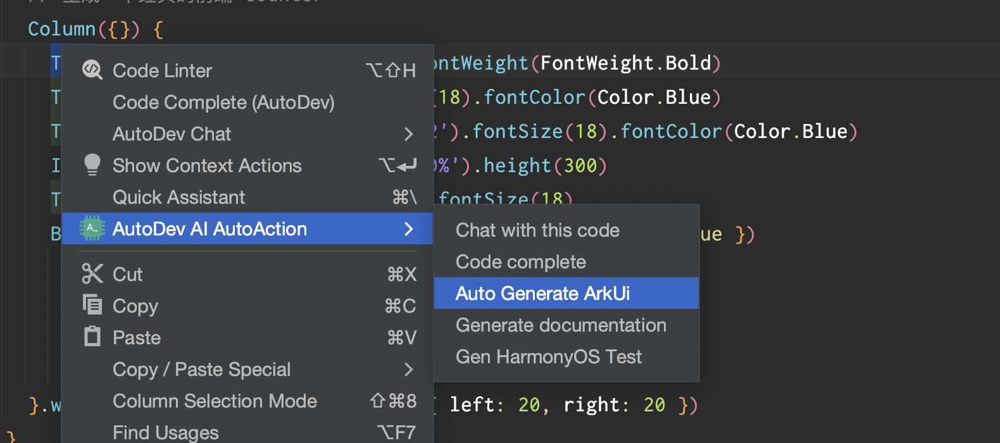

# AI 迁移 Android 布局


## 使用方式

1. 从插件市场安装应用：[https://plugins.jetbrains.com/plugin/21520-autodev](https://plugins.jetbrains.com/plugin/21520-autodev)
2. 选中需求，右键选择 `AutoDev AI Action`，点击 `Auto Generate ArkUI` 即可生成代码。



### 布局移动示例

在 Android Studio 或者 DevEco Studio 中，选中对应的布局文件，右键选择 `AutoDev AI Action`，点击 `Auto Generate ArkUI` 即可生成代码。

```xml
<?xml version="1.0" encoding="utf-8"?>
<LinearLayout xmlns:android="http://schemas.android.com/apk/res/android"
              android:layout_width="match_parent"
              android:layout_height="match_parent"
              android:orientation="vertical" >
    <TextView android:id="@+id/text"
              android:layout_width="wrap_content"
              android:layout_height="wrap_content"
              android:text="Hello, I am a TextView" />
    <Button android:id="@+id/button"
            android:layout_width="wrap_content"
            android:layout_height="wrap_content"
            android:text="Hello, I am a Button" />
</LinearLayout>
```

