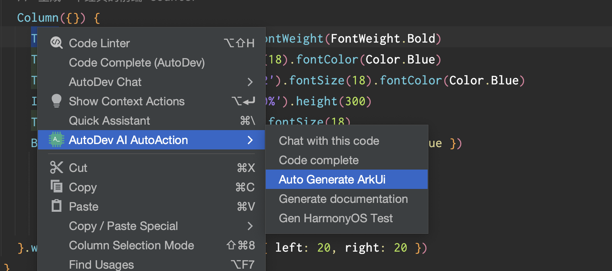

# AI 生成鸿蒙应用 ArkUI

## 使用方式

1. 从插件市场安装应用：[https://plugins.jetbrains.com/plugin/21520-autodev](https://plugins.jetbrains.com/plugin/21520-autodev)
2. 选中需求，右键选择 `AutoDev AI Action`，点击 `Auto Generate ArkUI` 即可生成代码。



## 需求示例

## Counter

```ArkTS
// 生成一个经典的前端 counter
```

Sample code:

```ArkTS
Column({}) {
  Text('Blog Title').fontSize(24).fontWeight(FontWeight.Bold)
  Text('Author: John Doe').fontSize(18).fontColor(Color.Blue)
  Text('Published Date: July 1, 2022').fontSize(18).fontColor(Color.Blue)
  Image('blog_image.jpg').width('100%').height(300)
  Text('Blog Content goes here...').fontSize(18)
  Button('Like', { type: ButtonType.Normal, stateEffect: true })
    .borderRadius(8)
    .backgroundColor(0xFF0000)
    .width(100)
    .height(40)
}.width('100%').margin(20).padding({ left: 20, right: 20 })
```

### 聊天列表页

```ArkTS
// 生成一个聊天列表页，item 需要包含头像、昵称、最后一条聊天记录，尽可能让页面美观
```

Sample code:

```ArkTS
Row() {
  List({ space: 10 }) {
    ListItem() {
      Row({ space: 20 }) {
        Image(this.avatarUrl)
          .width(40)
          .height(40)
        Column() {
          Text(this.nickname)
            .fontSize(16)
            .fontWeight('bold')
          Text(this.lastMessage)
            .fontSize(12)
            .fontColor('#666666')
        }
      }
    }
  }
  .width('100%')
  .height(200)
  .padding(10)
  .backgroundColor(Color.Pink)
}
```

### Search 组件

```ArkTS
// 生成 Search 组件，可以设置placeholder文本样式和颜色、搜索框内文本样式，以及submit和onChange等方法触发时的操作。
```

Sample code:

```ArkTS
Column() {
  TextInput()
    // .placeholder('请输入搜索内容')
    .placeholderFont({ size: 16, weight: 400 })
    .placeholderColor(Color.Grey)
    .fontColor(Color.Black)
    .fontSize(18)
    .width('100%')
    .height(40)
    .margin(10)
    .onChange((value: string) => {
      console.log(value);
      // Perform onChange action
    });
  Button('搜索', { type: ButtonType.Normal })
    .width(80)
    .height(36)
    .onClick(() => {
      // Perform submit action
    })
    .margin(10);
}
```

### 音乐专辑主页

```ArkTS
// 音乐专辑主页
// 头部返回栏: 因元素单一、位置固定在顶部，因此适合采用自适应拉伸，充分利用顶部区域。
// 专辑封面: 使用栅格组件控制占比，在小尺寸屏幕下封面图与歌单描述在同一行。
// 歌曲列表: 使用栅格组件控制宽度，在小尺寸屏幕下宽度为屏幕的100%，中尺寸屏幕下宽度为屏幕的50%，大尺寸屏幕下宽度为屏幕的75%。
// 播放器: 采用自适应拉伸，充分使用底部区域。
```

Sample code:

```ArkTS
Column({ space: 0 }) {
  // 头部返回栏
  Row() {
    // Icon('arrow_back').onClick(this.goBack)
    Text('专辑主页').flexGrow(1).textAlign(TextAlign.Center)
    // Icon('more_vert').onClick(this.showMenu)
  }.height(50).width('100%').backgroundColor(0x2196F3)

  // 专辑封面
  Row({ space: 10 }) {
    Image('album_cover').width('30%').aspectRatio(1).backgroundColor(0xFFCC00)
    Text('歌单描述').width('70%').backgroundColor(0xF5F5F5)
  }.width('90%')

  // 歌曲列表
  Column({ space: 5 }) {
    Flex({
      direction: FlexDirection.Row,
      wrap: FlexWrap.NoWrap,
      justifyContent: FlexAlign.SpaceBetween,
      alignItems: ItemAlign.Center
    }) {
      Text('歌曲1').width('30%').height(50).backgroundColor(0xD2B48C)
      Text('歌曲2').width('30%').height(50).backgroundColor(0xF5DEB3)
      Text('歌曲3').width('30%').height(50).backgroundColor(0xD2B48C)
    }
    .width('100%')
    .backgroundColor(0xAFEEEE)

    Flex({
      direction: FlexDirection.Row,
      wrap: FlexWrap.NoWrap,
      justifyContent: FlexAlign.SpaceBetween,
      alignItems: ItemAlign.Center
    }) {
      Text('歌曲4').width('30%').height(50).backgroundColor(0xF5DEB3)
      Text('歌曲5').width('30%').height(50).backgroundColor(0xD2B48C)
      Text('歌曲6').width('30%').height(50).backgroundColor(0xF5DEB3)
    }
    .width('100%')
    .backgroundColor(0xAFEEEE)
  }
  .width('75%')

  // 播放器
  Row() {
    // Icon('play_arrow')
    Text('播放器').flexGrow(1).textAlign(TextAlign.Center)
    // Icon('favorite_border')
  }.height(50).width('100%').backgroundColor(0x2196F3)
}
```

### 健康饮食详细页

```ArkTS
// 生成一个：健康饮食详细页。
// 要求：使用滑动组件展示食物的详细信息，包括使用画布组件展示单位重量的食物各个营养元素的的占比,使用进度条组件展示当前食物是否为高热食物，
// 以及展示单位重量的食物所包含的热量、脂肪、蛋白质、碳水以及维他命C值；并且点击记录按钮可以弹出记录饮食的弹窗，包括记录食物的种类、重量以及用餐时间，
// 可以通过点击完成添加饮食，同时添加的饮食信息会在“记录”Tab页签做展示。
````

Sample code:

```ArkTS
Column({ space: 10 }) {
  Text('食物名称')
    .textAlign(TextAlign.Center)
    .fontSize(20)
    .fontColor('#ff0000')

  Row() {
    Text('食物详情')
      .margin({ right: 10 })
      .width('60%')
      .height(300)
      .backgroundColor(0xF5DEB3)

    Column({ space: 5 }) {
      Flex({
        direction: FlexDirection.Row,
        wrap: FlexWrap.NoWrap,
        justifyContent: FlexAlign.SpaceBetween,
        alignItems: ItemAlign.Center
      }) {
        Text('热量')
          .width('30%')
          .height(50)
          .backgroundColor(0xF5DEB3)
        Text('脂肪')
          .width('30%')
          .height(50)
          .backgroundColor(0xD2B48C)
        Text('蛋白质')
          .width('30%')
          .height(50)
          .backgroundColor(0xF5DEB3)
      }
      .height(70)
      .width('90%')
      .backgroundColor(0xAFEEEE)

      Flex({
        direction: FlexDirection.Row,
        wrap: FlexWrap.NoWrap,
        justifyContent: FlexAlign.SpaceBetween,
        alignItems: ItemAlign.Center
      }) {
        Text('碳水')
          .width('30%')
          .height(50)
          .backgroundColor(0xF5DEB3)
        Text('维他命C')
          .width('30%')
          .height(50)
          .backgroundColor(0xD2B48C)
      }
      .height(70)
      .width('90%')
      .backgroundColor(0xAFEEEE)

      Progress({ value: 0, total: 100, type: ProgressType.Capsule })
        .width(200)
        .height(50)
        .style({ strokeWidth: 50 })
      // .value(this.progressValue)

      Button('记录', { type: ButtonType.Normal, stateEffect: true })
        .borderRadius(8)
        .margin({ left: 12 })
        .backgroundColor(0x317aff)
        .width(90)
        .height(40)
        .onClick(() => {
          // 弹出记录饮食的弹窗
          // this.dialogController.open()
        })
    }
  }

  Text('用餐记录')
    .textAlign(TextAlign.Center)
    .fontSize(16)
    .fontColor('#0000ff')

  Column() {
    // 饮食记录展示
    // CustomDialogControllerExample({})
  }
}
.width('90%')
```
