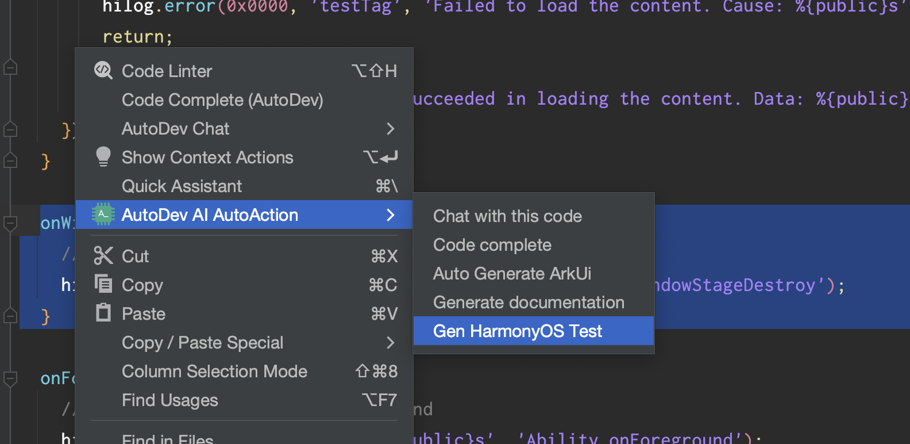

# AI 生成 HarmonyOS 测试代码 

## 使用方式

1. 从插件市场安装应用：[https://plugins.jetbrains.com/plugin/21520-autodev](https://plugins.jetbrains.com/plugin/21520-autodev)
2. 在项目目录创建 `prompts/Gen-HarmonyOS-Test.vm` 文件，写入 prompt
3. 右键选中内容，执行 `AutoDev AI Action`，点击 `Gen HarmonyOS Test` 即可生成测试代码。

右键示例：



## Prompt 示例


    ---
    interaction: ChatPanel
    ---
       
    Write Test for follow ${language} language code.
    
    1. You should use `describe` `it` `expect` to write test.
    2. Here is '@ohos/hypium' test framework support method, you can use it:
    ```ArkTS
    assertClose(expectValue: number, precision: number): void, assertContain(expectValue: any): void, assertEqual(expectValue: any): void,
    assertFail(): void, assertFalse(): void, assertTrue(): void, assertInstanceOf(expectValue: string): void, not(): Assert;,
    assertDeepEquals(expectValue: any):void, assertPromiseIsPending(): void, assertPromiseIsRejected(): void,
    assertPromiseIsRejectedWith(expectValue?: any): void, assertPromiseIsRejectedWithError(...expectValue): void,
    assertPromiseIsResolved(): void, assertPromiseIsResolvedWith(expectValue?: any): void
    ```
    
    For example:
    
    ```ArkTS
    import { describe, it, expect } from '@ohos/hypium'
    
    export default function abilityTest() {
      describe('ActsAbilityTest', function () {
        it('assertContain',0, function () {
          let a = 'abc'
          let b = 'b'
    
          expect(a).assertContain(b)
          expect(a).assertEqual(a)
        })
      })
    }
    ```
    
    Here is user code:
    
    ```ArkTS
    ${selection}
    ```
    
    Please write test for it, use markdown syntax.
    